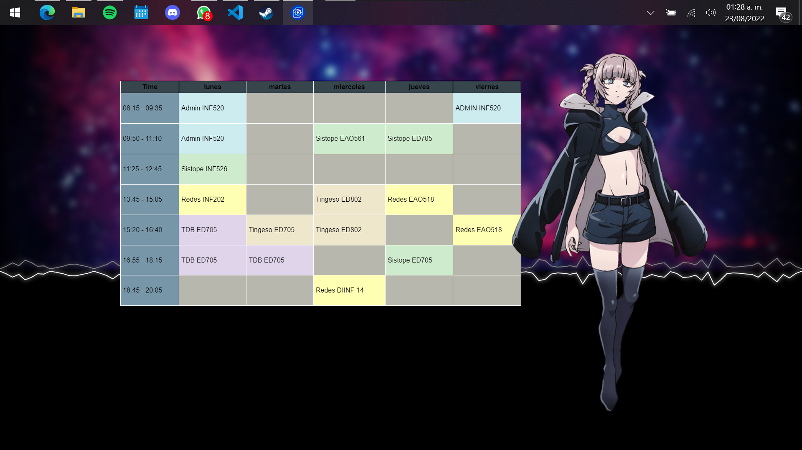

<center>
    <h1 align="center">Horario para wallpaper engine</h1>
    <h4 align="center">Un horario web para Wallpaper Engine.</h4>
    <p align="center">
        <strong>Última actualización:</strong> 25 Marzo 2023<br>
    </p>
</center>
Preview wallpaper
<center>
    
    
</center>

### CARACTERÍSTICAS
- Horario personalizable
- Integracion con Spotify 
- Obtener la Hora actual segun tu computadora
- Colocar un personaje personalizado mediante un Gif/png

### INSTRUCCIONES DE USO

- Descarga el repositorio en su formato zip y descomprímelo en una carpeta destino (por ejemplo, escritorio) o utiliza el siguiente comando para clonarlo en la carpeta destino (por ejemplo, escritorio):
``` 
git clone https://github.com/pipetboy2001/Horario-para-Wallpaper-Engine
```

- Asegúrate de tener instalado Wallpaper Engine, lo puedes comprar en [Steam](https://store.steampowered.com/app/431960/Wallpaper_Engine/)

- Abre el Editor de Fondos de Wallpaper Engine, selecciona "Crear Fondos" y elige el archivo HTML de la carpeta destino (por ejemplo, escritorio) y guarda.


### NOTAS DE SPOTIFY
- Para generar un token, puedes ir a este [enlace](spotify-visualiser.vercel.app)
- Una vez en el sitio, debes iniciar sesión para conectar tu cuenta de Spotify.
- La página generará una larga cadena de letras aleatorias. Copia y pega este código en el motor de fondo de pantalla en el cuadro de texto del token.
- Si el token no funciona inicialmente, intenta cambiar a otro fondo de pantalla y luego vuelve a cambiar.
- Asegúrate de que tu Spotify no esté en una sesión privada, ya que el fondo de pantalla no funcionará.
NO publiques presets con tu token, a menos que quieras que la gente vea qué música estás escuchando.

### CÓMO MODIFICAR EL HORARIO
- El horario se modifica en el archivo table.js en las tablas donde se ve por todas las materias que se encuentren en ese horario
- Los colores y fondo son modificables en el archivo estilos.css donde encontrarás las clases y bg-image para editar el fondo.